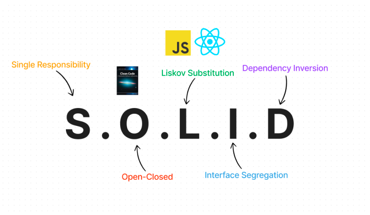

# React S.O.L.I.D Principles for writing clean-code



- SRP: Single Responsibility Principle
  - Every class should have only one responsibility
- OCP: Open-Closed Principle
  - Software entities should be open for extension but closed for modification
- LSP: Liskov Substitution Principle
  - Subtype objects should be substitutable for super type object
- ISP: Interface Segregation Principle
  - Clients should not depends upon interfaces that they don't use 
- DIP: Dependency Inversion Principle
  - One entity should depends on abstractions not concretions

All the principles are explained on CoderOne's youtube channel: https://youtu.be/MSq_DCRxOxw

## Code

This Repo has examples for all principles implemented in React. Go inside `src/principle` there will be all principles there with isolated demos.

You can run the dev server using:

```bash
yarn install
yarn dev
```

Change the component in `App.tsx` with the corresponding Principle's component name to see the demo.

### Example

```tsx
function App() {
  return (
    <div className="flex min-w-full h-full justify-center items-center p-8">
      {/* <SRP /> */}
      {/* <OCP /> */}
      {/* <LSP /> */}
      <DIP />
    </div>
  );
}
```
